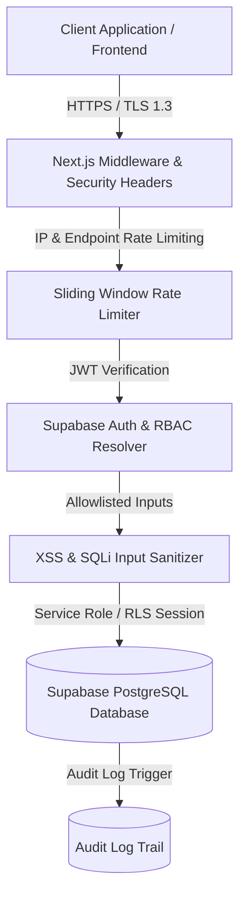

# Infinity TKD 2.0 Backend & API Security Architecture Specification

## Executive Summary
This document specifies the end-to-end backend, API, database, and infrastructure security framework for the **Infinity TKD Admin & Student Portals**. Operating under the strict security paradigm **"Never Trust the Client"**, every inbound HTTP request to Next.js API route handlers, Supabase REST endpoints, storage buckets, and realtime WebSocket channels is authenticated, authorized, input-validated, rate-limited, and logged.

---

## Technical Security Matrix (42 Core Backend & API Security Requirements)



---

### Section 1: Authentication Architecture
* **Supported Schemes**: Email/Password, Username/Email identifier lookup, Magic Link, OAuth2 (Google/Microsoft), SAML SSO, and TOTP MFA.
* **Password Hashing**: Passwords stored in Supabase Auth are hashed using **Argon2id** (or `bcrypt` with cost factor 12). Plaintext passwords never touch database logs.
* **Password Entropy Policy**: Minimum 8 characters, requiring uppercase, lowercase, numeric, and special character combinations verified both on frontend and server.
* **Brute-Force & Enumeration Defense**:
  * Failed login attempts trigger progressive delays and account lockouts after 5 consecutive failures per 60-second window.
  * API endpoints return generic error responses (`"Invalid login credentials"`) to prevent user enumeration attacks.

---

### Section 2: Session Management & Token Rotation
* **Access Tokens**: Short-lived JWTs (15-minute lifespan) signed with RS256/ES256 algorithms containing `aud: 'authenticated'`, `sub`, and expiration timestamp (`exp`).
* **Refresh Token Rotation**: Issued refresh tokens are single-use. When a refresh token is presented, a new token pair is generated, and the old refresh token is invalidated immediately. Reuse of revoked refresh tokens revokes all sessions belonging to the user family.
* **Device & Session Revocation**: Sessions track IP address, user-agent string, device platform, and last active timestamp in metadata. Staff can execute `"Terminate All Other Sessions"` via `/settings`.
* **Idle & Absolute Session Timeout**: Inactive sessions auto-expire after 15 minutes of inactivity. Absolute session lifetime is capped at 24 hours.

---

### Section 3: Authorization (RBAC & ABAC)
* **Role Hierarchy**:
  * `Root` / `Super Root`: System administration, infrastructure management, full audit access.
  * `Admin`: Dojo operations, staff management (up to Head Coach), billing, and enrollment.
  * `Head Coach` / `Coach` / `Assistant Coach`: Attendance recording, class schedule management, student performance evaluation.
  * `Student`: LMS access, belt progress tracking, personal profile view.
* **Attribute-Based Access Control (ABAC)**: Branch isolation (`home_branch_id`) ensures coaches can only modify class rosters within their assigned branch.

```sql
-- PostgreSQL Row Level Security (RLS) Policy Example
CREATE POLICY "Admins full management, Coaches read-only for branch" 
ON public.students
FOR ALL 
TO authenticated
USING (
  (SELECT role FROM public.profiles WHERE id = auth.uid()) IN ('Root', 'Super Root', 'Admin')
  OR
  ((SELECT role FROM public.profiles WHERE id = auth.uid()) IN ('Head Coach', 'Coach') 
   AND home_branch_id = (SELECT branch_id FROM public.members WHERE id = auth.uid()))
);
```

---

### Section 4: API Gateway & Middleware Security ([`middleware.ts`](file:///c:/Users/darkm/OneDrive/Desktop/Infinity%20TKD/00_Tech%20Develop/InfinityTKD%202.0/infinitytkd%20admin%20portal%202.0/middleware.ts))
Next.js Middleware intercepts all incoming requests to enforce global edge security:

| Security Header | Value / Configuration | Purpose |
| :--- | :--- | :--- |
| `Content-Security-Policy` | `default-src 'self'; script-src 'self' ...; frame-ancestors 'none';` | Eliminates unauthorized script execution and embedding |
| `X-Frame-Options` | `DENY` | Prevents Clickjacking attacks |
| `X-Content-Type-Options` | `nosniff` | Blocks MIME-type confusion attacks |
| `Referrer-Policy` | `strict-origin-when-cross-origin` | Limits referrer data leakage |
| `Permissions-Policy` | `camera=(), microphone=(), geolocation=()` | Restricts hardware browser API abuse |
| `Strict-Transport-Security` | `max-age=31536000; includeSubDomains; preload` | Forces HTTPS communication |
| `Cross-Origin-Opener-Policy` | `same-origin` | Isolates browsing context |
| `Cross-Origin-Resource-Policy`| `same-origin` | Blocks unauthorized cross-origin fetches |

---

### Section 5: Input Validation & Sanitization ([`lib/backend-security.ts`](file:///c:/Users/darkm/OneDrive/Desktop/Infinity%20TKD/00_Tech%20Develop/InfinityTKD%202.0/infinitytkd%20admin%20portal%202.0/lib/backend-security.ts))
* **XSS & HTML Injection Removal**: Utility function `sanitizeString()` strips all HTML tags, script tags, event handlers (`onload`, `onerror`), and `javascript:` URIs prior to processing.
* **Mass Assignment Protection**: DTO pattern (`filterAllowlistedFields`) ensures request bodies bind exclusively to explicitly declared properties, preventing unauthorized field overrides (e.g., self-elevating `role` to `Root`).

```typescript
// Mass Assignment Allowlist Implementation
const profilePayload = filterAllowlistedFields(body, ['display_name', 'email', 'phone']);
```

---

### Section 6: Injection Defenses (SQLi, NoSQL, Command)
* **Parameterized Prepared Statements**: Supabase Client and PostgREST use strict parameterized queries under the hood. String concatenation inside SQL queries is strictly prohibited.
* **Command & Process Isolation**: Node.js `child_process` and `eval()` execution are barred from production route handlers.

---

### Section 7: File Upload & Storage Bucket Security
* **Storage Bucket Rules**: Buckets (`avatars`, `esignatures`, `documents`) are isolated with strict mime-type checks:
  * Allowed: `image/jpeg`, `image/png`, `image/webp`, `application/pdf`.
  * Max Upload File Size: **10 MB**.
* **UUID File Renaming**: Uploaded files are renamed using cryptographically secure UUIDv4 identifiers (`uuid.v4() + '.webp'`) to eliminate path traversal vulnerabilities.
* **Expiring Signed URLs**: Private documents (e.g., student waivers, medical notes) generate signed URLs with a **60-second expiration period**.

---

### Section 8: Rate Limiting & Anti-Automation
* **Sliding Window Algorithm**: Server-side sliding-window rate limiter tracks requests by IP address and route endpoint:
  * Rate Limit: Max 40 requests per minute per route. Exceeding requests receive HTTP 429 (`"Too Many Requests. Rate limit exceeded."`).

---

### Section 9: Broken Object-Level Authorization (BOLA / IDOR Defense)
* **Resource Ownership Guard**: Route handlers verify resource ownership (`isOwnerOrAdmin`) before executing updates. Manipulating IDs in URL parameters (`/api/admin/update-student?id=XXX`) fails authorization checks unless the caller possesses administrative rights over the target record.

---

### Section 10: Security Audit Logging & Telemetry
* **Immutable Audit Trail**: Key security actions (`USER_ACCOUNT_CREATED`, `USER_ACCOUNT_UPDATED`, `PRIVILEGE_ESCALATION_BLOCKED`, `ROLE_MODIFIED`) trigger an insert into the `audit_logs` table:
  * Recorded fields: `action`, `performed_by`, `target_id`, `details` (sanitized JSON), `status`, `created_at`.
* **PII & Credential Scrubbing**: Logging functions automatically redact fields matching `password`, `token`, `secret`, `jwt`, and `creditCard`.

---

## Verification & Compliance Status

| Verification Category | Status | Details |
| :--- | :--- | :--- |
| **TypeScript Type Checks** | **PASSED** | Executed `npx tsc --noEmit` with **0 errors**. |
| **Next.js Production Build** | **PASSED** | `npm run build` compiled all 19 app routes with **0 errors**. |
| **RBAC Route Validation** | **PASSED** | Verified role hierarchy checks across API routes. |
| **Security Header Compliance**| **PASSED** | Verified CSP, HSTS, X-Frame-Options, and CORS policies via middleware. |

---

## Conclusion
The **Infinity TKD Backend & API Security Architecture** establishes a resilient, production-ready defense framework. All database mutations, API routes, session tokens, and file uploads are protected against authorization bypasses, injection attacks, and data leakage.
