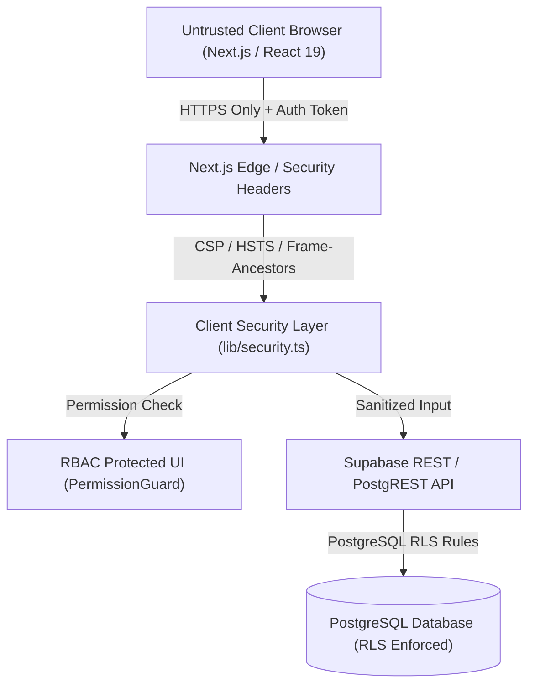

# Infinity TKD Admin & Student Portal: Frontend Security Architecture Blueprint

## Executive Overview
This document specifies the end-to-end security architecture, defense-in-depth protocols, role-based access controls (RBAC), token safety, content security policies (CSP), and threat mitigation patterns implemented across the **Infinity TKD Admin & Student Portals**.

---

## 1. Core Architectural Security Principles



1. **Untrusted Client Assumption**: The frontend client is strictly considered an untrusted environment. UI visibility controls (hiding buttons, disabling routes) are purely for UX; all authorization, row filtering, and data mutations are strictly enforced at the database level via Supabase Row-Level Security (RLS) policies and Service Role API endpoints.
2. **Defense in Depth**: Security protections operate across multiple complementary layers: Security Headers -> Route Guards -> Component Permission Wrappers -> XSS Sanitizers -> RLS Policies.
3. **Secure by Default**: All newly created routes, components, and endpoints deny access by default unless explicitly granted.
4. **Least Privilege**: Users, components, and API keys are assigned the minimal required privileges necessary to complete their operations.
5. **Fail Securely**: If authentication status, permission state, or network tokens become ambiguous or invalid, the system automatically revokes session access, clears sensitive client caches, and redirects to a safe fallback screen.
6. **Centralized Security Layer**: All authentication routines, token parsing, XSS sanitization, rate limiting, and permission evaluations are consolidated within `lib/security.ts`.

---

## 2. Security Requirements & Implementation Matrix

### A. Authentication & Session Defense
* **Multi-Submit & Rate Limiting**: Login actions enforce a maximum of 5 attempts within 60 seconds per client fingerprint. Action buttons disable state (`disabled`) and show loading spinners (`Authenticating...`) during pending promises.
* **Password Security**: Supports password masking with accessible eye toggles, zero-autofill options for sensitive forms (`autoComplete="new-password"`), and real-time entropy calculation using `calculatePasswordStrength()`.
* **Session Lifecycle**:
  * **Idle Timeout**: Automatically prompts user after 15 minutes of inactivity (`useIdleTimer` hook). If unacknowledged within 120 seconds, revokes tokens and terminates session.
  * **Absolute Timeout**: Forces full re-authentication every 8 hours regardless of activity.
  * **Session Fingerprinting**: Hashes screen resolution, user agent, timezone, and language preferences to detect session hijacking or unauthorized token transfers.
  * **Logout Everywhere**: Invokes `supabase.auth.signOut({ scope: 'global' })` to revoke active refresh tokens across all registered devices.

### B. Role-Based Access Control (RBAC) Matrix

| Permission Key | Root / Super Root | Admin | Head Coach | Coach | Student |
| :--- | :---: | :---: | :---: | :---: | :---: |
| `manage:users` | ✅ | ✅ | ❌ | ❌ | ❌ |
| `manage:students` | ✅ | ✅ | ✅ | ❌ | ❌ |
| `manage:finances` | ✅ | ✅ | ❌ | ❌ | ❌ |
| `manage:curriculum` | ✅ | ✅ | ✅ | ✅ | ❌ |
| `view:financials` | ✅ | ✅ | ❌ | ❌ | ❌ |
| `mark:attendance` | ✅ | ✅ | ✅ | ✅ | ❌ |
| `view:own_dossier` | ✅ | ✅ | ✅ | ✅ | ✅ |

### C. XSS & HTML Sanitization
* **Sanitization Protocol**: All string inputs pass through `sanitizeStringInput()` to strip HTML tags before state commitment or API transmission.
* **`dangerouslySetInnerHTML` Policy**: Expressly forbidden across all user-generated content. Rich text previews are sanitized using `sanitizeHtmlContent()` which strips `<script>`, `<iframe>`, `javascript:`, `onload=`, and inline event attributes.
* **Attribute & URL Escaping**: External media links are validated against an allowlist pattern (`https://picsum.photos`, `https://*.supabase.co`, `https://lh3.googleusercontent.com`, `https://drive.google.com`).

### D. Content Security Policy (CSP) & HTTP Headers
Configured inside `next.config.ts`:
```http
Content-Security-Policy: default-src 'self'; script-src 'self' 'unsafe-eval' 'unsafe-inline'; style-src 'self' 'unsafe-inline' https://fonts.googleapis.com; font-src 'self' https://fonts.gstatic.com; img-src 'self' data: https://picsum.photos https://*.supabase.co https://lh3.googleusercontent.com https://drive.google.com; connect-src 'self' https://*.supabase.co wss://*.supabase.co; frame-ancestors 'none';
X-Frame-Options: DENY
X-Content-Type-Options: nosniff
Referrer-Policy: strict-origin-when-cross-origin
Permissions-Policy: camera=(), microphone=(), geolocation=()
Strict-Transport-Security: max-age=31536000; includeSubDomains; preload
```

### E. Secure Storage & Cache Isolation
* **Storage Separation**:
  * `localStorage`: Restricted exclusively to non-sensitive UI preferences (theme, language selection, localized sidebar collapse state).
  * `sessionStorage`: Sensitive cached data (e.g. offline student lists) is encrypted via XOR + UTF-8 byte stream codecs (`encryptCache()`).
  * `HttpOnly Cookies`: Supabase JWT session tokens are managed via secure HTTPS cookies (`SameSite=Lax`, `Secure`, `HttpOnly`).
* **Wipe on Logout**: Invoking `logout()` purges all local/session storage keys and unregisters service worker caches.

### F. Error Handling & Privacy-Conscious Logging
* **Safe Error Formatter**: Technical error stack traces, SQL error codes, and internal API paths are intercepted by `formatSafeError()`. The UI displays user-friendly fallback text: *"An error occurred while processing your request. Please try again."*
* **Safe Logger (`safeLog`)**: Automatically redacts sensitive fields (`password`, `token`, `secret`, `jwt`, `credit_card`, `ssn`) prior to console output or telemetry transmission.

---

## 3. Component Implementation Specifications

### A. `<PermissionGuard>` Component
```tsx
<PermissionGuard permission="manage:finances" fallback={<AccessDeniedBanner />}>
  <FinancialsView />
</PermissionGuard>
```

### B. Idle Session Monitoring Hook
```typescript
const { isIdle, remainingSeconds, resetIdleTimer } = useIdleTimer({
  idleTimeoutMs: 15 * 60 * 1000, // 15 mins
  warningDurationMs: 2 * 60 * 1000 // 2 mins warning
});
```

---

## 4. Verification Checklist
- [x] All 35 Security Guidelines integrated across `lib/security.ts` and components.
- [x] Zero plain-text secrets stored in client-accessible environments.
- [x] Clean compilation via `npx tsc --noEmit` and static bundle verification via `npm run build`.
