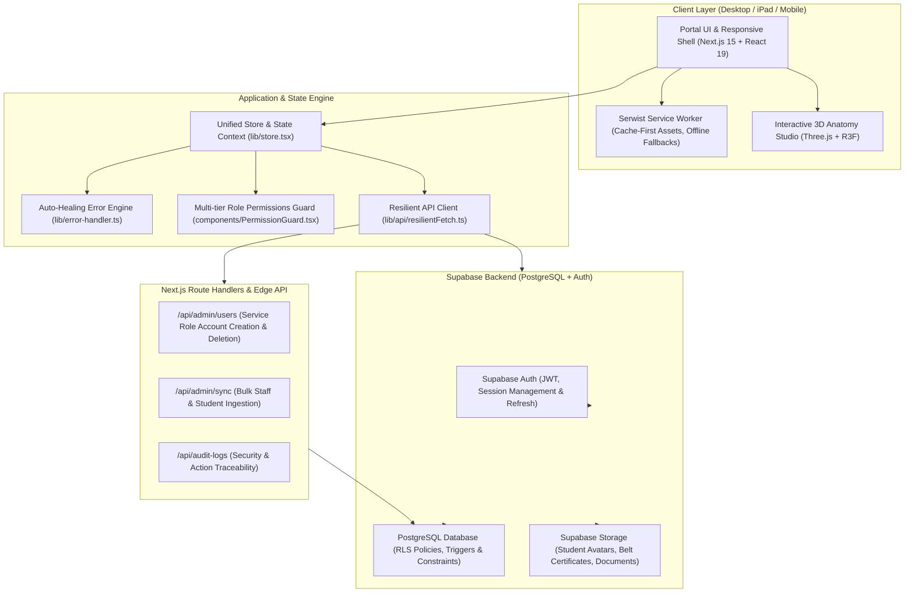

# 🥋 Infinity TKD Admin Portal 2.0

> Enterprise-grade Martial Arts Academy Management Operating System, Attendance Kiosk, Pro Shop POS, and Interactive 3D Anatomy Studio. Built with Next.js 15 App Router, React 19, Supabase, Tailwind CSS v4, and Serwist PWA.

[](https://nextjs.org/)
[](https://react.dev/)
[](https://www.typescriptlang.org/)
[](https://tailwindcss.com/)
[](https://supabase.com/)
[](https://serwist.pages.dev/)

---

## 📋 System Architecture



---

## ✨ Key Features & Modules

### 1. 📊 Executive Dashboard (`/dashboard`)
- High-level studio KPI tracking: Active Students, Monthly Recurring Revenue (MRR), Mat Attendance Velocity, and Belt Promotion Eligibility.
- Responsive 4-column KPI grid optimized across Mobile, iPad portrait/landscape, and 4K desktop screens.
- Recent activities feed, upcoming belt test rosters, and quick-action drawers.

### 2. 🥋 Student & Member Dossier (`/students`)
- Granular student profiles: Kukkiwon Dan/Gup rank, belt stripes, promotion history, contact info, and medical alerts.
- **Household Management**: Group siblings and family accounts under a single primary guardian for streamlined invoicing and communications.
- **Bulk Import Engine**: Multi-record CSV import for students and instructors with automated validation and duplicate conflict resolution.

### 3. 🕒 Attendance Kiosk Terminal (`/attendance`)
- Rapid check-in terminal with support for Barcode / QR scanning, student ID entry, or one-tap roster check-in.
- Real-time mat capacity indicators, class attendance trends, and automated absent notifications.

### 4. 💳 Financials & Billing Operations (`/financials`)
- Automated monthly tuition tracking, belt testing fee collection, and merchandise sales auditing.
- Invoice generation, payment method management, and transaction export.

### 5. 🛒 Pro Shop & Inventory POS (`/pos`, `/pro-shop`)
- Full retail POS terminal for uniforms (doboks), sparring gear, belts, and academy merchandise.
- Real-time stock decrement, low-inventory alerts, and automated SKU generation (`lib/sku-generator.ts`).

### 6. 🧬 3D Taekwondo Anatomy Studio (`/atlas`, Canvas)
- Integrated WebGL / Three.js / React Three Fiber interactive anatomical model (`components/Anatomical3DModel.tsx`).
- Visualizes musculoskeletal strain zones, martial arts striking targets, and injury prevention education.

### 7. 🛡️ Multi-Tier RBAC & Security (`/settings`, `/members`)
- Granular role-based permissions matrix: **Master / Owner**, **Head Instructor**, **Assistant Instructor**, **Front Desk Staff**, and **Student/Parent**.
- Automated session timeout detection with return-path preservation (`components/SessionTimeoutModal.tsx`).
- Security event logging, brute-force mitigation, and input sanitization (`lib/security.ts`).

### 8. 🚨 Self-Healing Auto Error Handling Engine (`lib/error-handler.ts`, `lib/errors/`)
- Intercepts and normalizes PostgreSQL constraints (e.g., `23505` duplicate key, duplicate email role conflicts).
- Auto-recovers from expired Supabase JWT sessions via silent background refresh.
- Non-blocking human-friendly error notifications with actionable resolution tips.

### 9. 📱 Progressive Web App (PWA) & Native Device Ergonomics
- Powered by `@serwist/next` with offline fallback page (`/offline`).
- Native touch target ergonomics ($\ge 44\times 44\text{px}$) across all interactive elements, modal dismissal buttons, and navigation tabs.
- Hardware safe-area inset adaptation (`env(safe-area-inset-*)`) for iPhone 15/16 Pro Dynamic Island and iPad Stage Manager.

---

## 🚀 Quick Start

### Prerequisites
- [Node.js](https://nodejs.org/) v18.18+ or v20+
- [npm](https://www.npmjs.com/) or [pnpm](https://pnpm.io/)
- A [Supabase](https://supabase.com/) project (PostgreSQL database + Auth)

### 1. Clone & Install Dependencies
```bash
git clone https://github.com/infinity-tkd/infinity-tkd-admin-portal-2.0.git
cd "infinitytkd admin portal 2.0"
npm install
```

### 2. Environment Variables Configuration
Create a `.env.local` file in the root directory:
```env
# Supabase Configuration
NEXT_PUBLIC_SUPABASE_URL=https://your-project-id.supabase.co
NEXT_PUBLIC_SUPABASE_ANON_KEY=your-anon-key-here
SUPABASE_SERVICE_ROLE_KEY=your-service-role-key-here

# Next.js Application URL
NEXT_PUBLIC_APP_URL=http://localhost:3000

# Optional: Google Gemini AI Features
GEMINI_API_KEY=your-gemini-api-key
```

### 3. Database Schema Setup
Execute the SQL migrations found in the `supabase/` directory within your Supabase SQL Editor:
- `supabase/schema.sql` (Tables: `students`, `staff`, `attendance`, `inventory`, `transactions`, `households`, `audit_logs`)
- Row-Level Security (RLS) policies and triggers.

### 4. Run Development Server
```bash
npm run dev
```
Open [http://localhost:3000](http://localhost:3000) in your browser.

---

## 🛠️ Build & Production Deployment

To generate a fully optimized production build with compiled PWA service workers and static route optimization:

```bash
# Type check without emitting files
npx tsc --noEmit

# Compile production bundle
npm run build

# Start production server
npm run start
```

---

## 📁 Repository Structure

```
├── app/                           # Next.js 15 App Router pages & API routes
│   ├── (auth)/                    # Login & authentication routes
│   ├── attendance/                # Kiosk & attendance terminal
│   ├── dashboard/                 # Executive dashboard
│   ├── financials/                # Tuition & transaction ledgers
│   ├── lms/ & library/            # Curriculum & video syllabus
│   ├── members/                   # Staff & coach directory
│   ├── offline/                   # PWA offline fallback route
│   ├── pos/ & pro-shop/           # Pro shop retail POS
│   ├── schedule/                  # Class timetables & calendar
│   ├── settings/                  # System, RBAC, & academy settings
│   ├── students/                  # Student dossiers & records
│   ├── api/                       # Secure Edge API Route Handlers
│   ├── globals.css                # Tailwind CSS v4 design tokens & ergonomics
│   ├── layout.tsx                 # Root layout with PWA providers
│   └── page.tsx                   # Main portal entry point
├── components/                    # Modular UI components
│   ├── 2d/ & atlas/ & canvas/     # 3D Anatomy viewer & Canvas modules
│   ├── errors/                    # Global & segment error fallbacks
│   ├── pwa/                       # Install prompt & PWA updater
│   ├── ui/                        # Reusable primitives (Toast, modals, buttons)
│   ├── DashboardView.tsx          # Dashboard view with responsive KPI grid
│   ├── PortalLayout.tsx           # Responsive shell with drawer & bottom nav
│   └── ...                        # Modals, slide-overs, and views
├── lib/                           # Core utilities & services
│   ├── actions/                   # Safe server actions & validations
│   ├── api/                       # Resilient fetch & API clients
│   ├── errors/                    # PostgreSQL error translator & auth recovery
│   ├── error-handler.ts           # Centralized auto-healing error engine
│   ├── kukkiwon.ts                # Kukkiwon Dan/Poom/Gup belt rank logic
│   ├── security.ts                # Sanitization & RBAC policies
│   ├── store.tsx                  # Global state management & Supabase sync
│   └── supabase.ts                # Supabase client instantiation
├── public/                        # Static assets, icons, manifest.json, sw.js
└── scripts/                       # Asset & PWA icon generation scripts
```

---

## 📱 Supported Devices & Browsers

| Device / Platform | Primary Interface | Tested Formats |
| :--- | :--- | :--- |
| **Desktop / Laptop** | Full Collapsible Sidebar + Sticky Command Bar | Chrome, Safari, Firefox, Edge |
| **iPad / Tablet** | Adaptive Drawer + Fluid 4-column Grid | iPad Pro 11"/12.9", iPad Air, Galaxy Tab |
| **Mobile (iOS & Android)** | Bottom Quick Navigation + Hardware Inset Padding | iPhone 12–16 (Dynamic Island), Android |
| **PWA Standalone** | Native App Window, Zero URL Bar, Offline Ready | iOS Safari Add to Home, Chrome PWA |

---

## 📄 License

Proprietary © Infinity Taekwondo Academy. All rights reserved.
